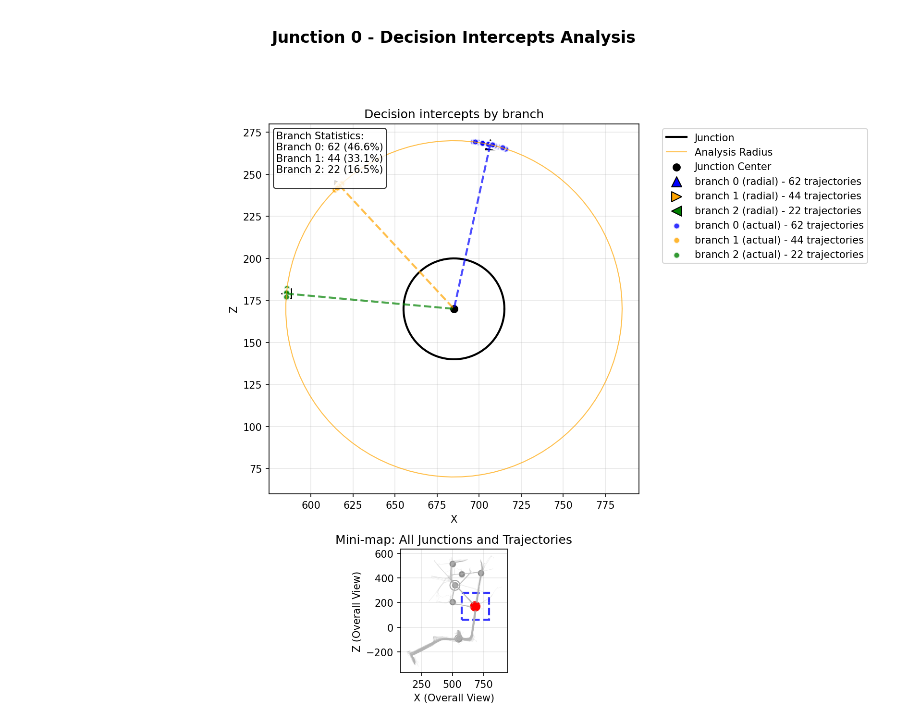

# Summary

`VERTA` (Virtual Environment Route and Trajectory Analyzer) is a Python package for automated route choice analysis in virtual environments. Researchers can easily collect detailed movement data showing where people move in virtual environments. However, turning these raw trajectories into meaningful insights about decision-making, such as identifying where choices occur and which routes are preferred, remains challenging. `VERTA` addresses this by automating route choice analysis: it detects route decisions at intersections, identifies common route patterns, computes timing and speed metrics, and can predict future route choices based on observed behavioral trends. `VERAT` provides both a command-line interface for automated batch processing and a web-based graphical interface for interactive exploration. By standardizing how route choice data is analyzed, `VERTA` enables enables more consistent comparisons across studies and experimental conditions. This supports evidence-based design and evaluation of virtual environments, wayfinding systems, and evacuation strategies for professionals in fields such as urban planning, emergency management, and human–computer interaction.

# Statement of need

As extreme events become more common due to climate change, the need for evacuations is expected to increase as well [@Kuhl2014; @Thompson2017]. For example, evacuations may be necessary in urban areas due to flooding or in buildings due to fires. Virtual Reality (VR) has become an important research tool in this context because it allows researchers to study people's behavior in controlled evacuation scenarios. This includes the crucial question of how people choose evacuation routes when guidance is limited or unavailable [@Hung2025].

Beyond evacuation research, understanding route choice behavior in virtual environments is relevant across a wide range of applications, including wayfinding studies, navigation research, spatial cognition experiments, urban planning simulations, and human-computer interaction research (e.g. @Ahmad2024100472[], @Li2019120[]). Across these domains, researchers face a common challenge: translating raw movement trajectories generated in virtual environments into meaningful insights about how and why people choose particular routes.

The Virtual Environment Route and Trajectory Analyzer (`VERTA`) addresses this gap by providing standardized and reproducible methods to analyze route choice behavior in virtual environments. `VERTA` identifies where route decisions are made, summarizes which routes are preferred under different conditions, and enables systematic comparison across scenarios and experimental settings. These capabilities help build an evidence base for designing more effective evacuation routes and wayfinding systems. `VERTA` is designed to be accessible to a wide range of users by offering both programmatic tools and an interactive graphical interface.

# State of the field

Current research on route choices in virtual environments typically relies on a mix of custom scripts and general-purpose tools (e.g., `scikit-learn` and microscopic crowd or traffic simulators) rather than a dedicated pipeline. These tools typically work either at an aggregate level (e.g., discrete choice models applied to pre-encoded alternatives (e.g. @Hu2026105335[], @Lovreglio2022104452[])) or at the level of simulated flows (e.g. @Wang2024[], @Zhang2023106041[]). As a result, they do not directly support systematic analysis of route choices at specific junctions or how those decisions unfold across multiple junctions. `VERTA` complements this existing ecosystem. Given user-defined junction locations and decision regions, it processes raw x–z VR trajectories and derives standardized decision outcomes (branch assignments), timing metrics, gaze- and physiology-based summaries, and junction-level patterns (including conditional probabilities and early intent predictions). This makes route choice analysis more reproducible and comparable across studies, while allowing existing simulators and statistical models to build on consistent decision-level outputs.

# Software Design

`VERTA` uses a modular architecture that keeps the core analysis components (decision detection, clustering, metrics, prediction) separate from the user interface. We developed a command-line interface (CLI), as researchers often need reproducible, scriptable workflows for batch processing and for comparing different scenarios. We later added a web-based graphical user interface (GUI) built with Streamlit, which uses the same underlying code, making the tool accessible to users who are less comfortable with CLI.

The GUI includes advanced interactive features such as visual junction editing with click-to-add controls, real-time parameter adjustment with live visual feedback, interactive conditional probability analysis to reveal route transition patterns between junctions, and interactive `Plotly` visualizations with zoom and pan. These features enhance exploratory analysis beyond what is practical with the CLI alone.

`VERTA` offers multiple ways to detect decision points (pathlen, radial, hybrid) and different clustering methods (k-means, DBSCAN, automatic) to accommodate variability in VR movement behavior (e.g., differences in walking speed, pausing at intersections, and decision-making patterns). Once decision points are identified, `VERTA` automatically detects branch directions by clustering the direction vectors extracted at these points. The k-means method requires specifying the number of expected branches, DBSCAN discovers variable numbers without prior specification, and the automatic method searches for the optimal number within a specified range. This automated branch detection eliminates manual route classification and enables consistent identification of common route choices. Figure 1 illustrates how `VERTA` identifies decision points along trajectories at user-defined junctions, showing the spatial distribution of route choices and the detected decision intercepts and route directions.

This flexibility is important because by separating decision detection from branch assignment, `VERTA` allows researchers to compare results consistently across studies. In addition, its modular design makes it easy to add new features without breaking existing workflows. Further, providing both a CLI and a GUI supports different user needs: technical users can automate analyses at scale, while domain experts can explore trajectories interactively using advanced analysis and visualization tools.

# Research Impact Statement

We have already used VERTA in the "RESCUE" (Routing Efficiency Study of 2D and 3D Cartography for Urban Evacuations in Emergencies) research project. It has given us valuable insights in the route choice behavior and evacuation efficiency of a simulated flooding event in Frankfurt am Main (Germany) [@Suhre2025] in addition to the evacuees' perspectives [@Cai2025].

# AI usage disclosure

This project utilized AI-assisted development tools for various aspects of the codebase:

- **Cursor** and **ChatGPT** were used for:
  - Code refactoring
  - GUI design
  - Test scaffolding
  - Documentation refactoring and elaboration
  - Paper refinement
  - Logo design

# Acknowledgements

Funded by the European Union (ERC, scAInce, 101087218). Views and opinions expressed are
however those of the author(s) only and do not necessarily reflect those of the European Union or the
European Research Council Executive Agency. Neither the European Union nor the granting authority
can be held responsible for them.

Special thanks go to Isamu Lautenschläger for his insights into Machine Learning.

# References
